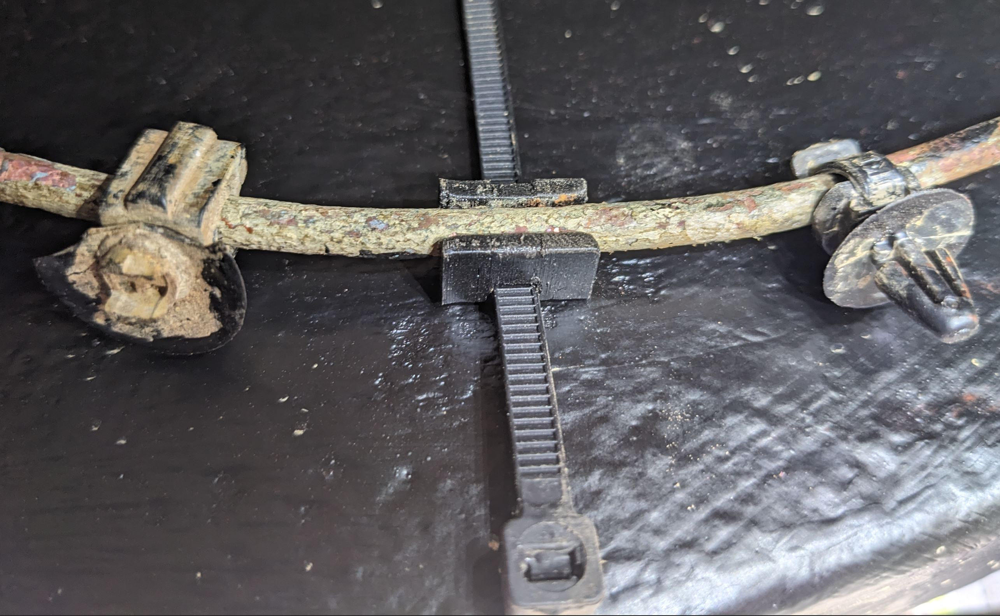
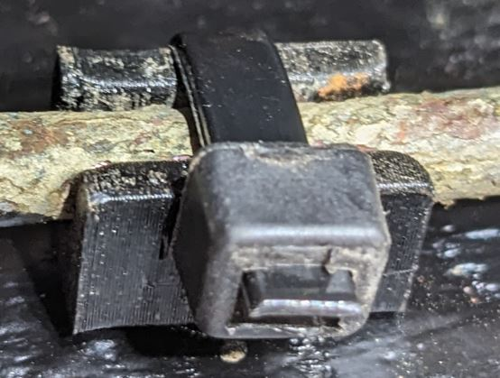
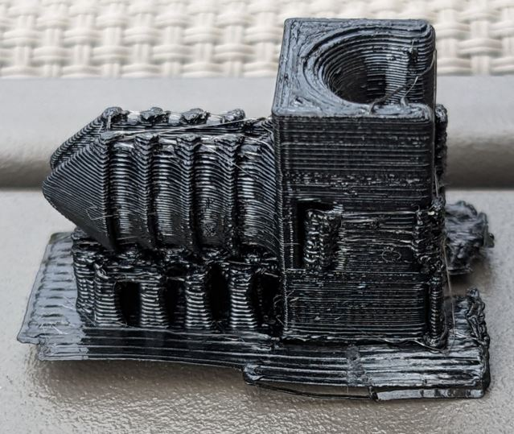
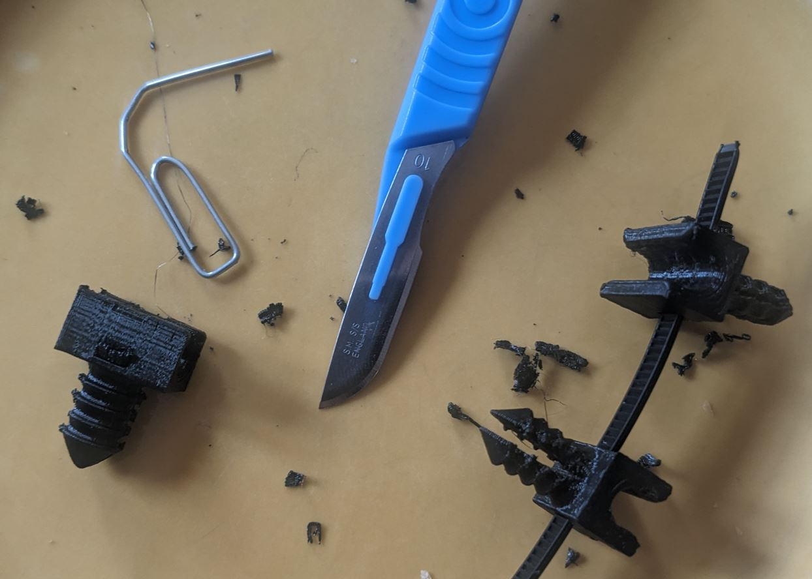

# Defender TD5 brake pipe clip
Clip to hold brake pipes to chassis for Defender TD5.
It fits into existing 7mmØ holes in chassis and holds a 5mmØ brake pipe secured 
by a 4.7mm*1.3mm nylon cable tie.
As this model is entirely parametric, these dimensions can easily be changed in the spreadsheet inside the FreeCAD file.

It's designed to be forced into the chassis with a hammer and strongly hold the brake pipe even without beeing
secured by the cable tie, but be aware that brake pipes are quite sensible parts of a vehicle and may result
to your death if not secured appropriately. Use this part at your own risk and check conditions of the brake pipe 
clip regularly. 

That being said, original brake pipe clips tend to brake apart on their own after some time, they don't seem
to be the most secure option either.

> We can see how well-designed is the original part (left), the section of the rivet 
> linking to the chassis is very small and breks easily.
> On the right, an aftermarket clip, does not brake but doesn't stay in the chassis either

## Print Settings
* Printer brand: Creality
* Printer: Ender 3
* Supports: Yes
* Resolution: 0.16
* Infill: 15%
* Filament brand: Overture
* Filament color: Black
* Filament material: PETG

## Post print

- Detach supports on the parts that fits into chassis hole by hand
- Use pliers to detach the other supports
- For the hole where the cable tie goes, try to fit a scalpel blade to detach it from the edges
Then grab it with pliers, and then with an unfolded paper clip try to push it out from the hole and push it out.
It can be a bit laborious depending on the print.

## Notes
I chose 90° of bed temperature and 250° for extruder. I print on painter tape to remove easily.
Slicing was made with PrusaSlicer 2.5.0, I changed perimeter to classical because it was asymetric and not sturdy with "Arachne", and i select "everywhere" for supports.
The print direction is from the side, and since then supports are needed for the "clip" part.
All these print settings are available alongside the model in the `clip_brakes.3mf` file.
I think it's really important to use PETG over PLA, a Defender leaking oil, fuel and grease, sprayed with water and mud, may shorten PLA lifetime to unacceptable levels.
